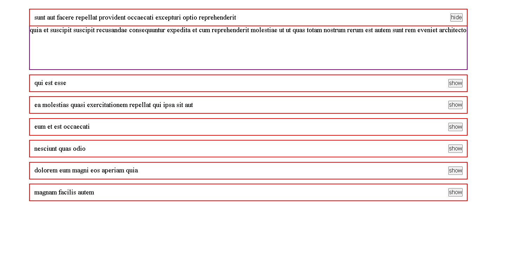

# Accordion Component

A simple React accordion component built with functional components and hooks. The accordion displays a list of items with a title and body, where only one item is expanded at a time.



## Project Structure

- `Accordion.js`: The main accordion component that renders the items.
- `OneAccordion.js`: A child component that displays a single accordion item.
- `Data.js`: A mock data file containing an array of items with titles and content for the accordion.

## Dependencies

- React (useState hook is used)

## How to Run

1. Clone this repository to your local machine:
    ```bash
    git clone https://github.com/your-username/accordion-component.git
    ```

2. Navigate to the project directory:
    ```bash
    cd accordion-component
    ```

3. Install the dependencies:
    ```bash
    npm install
    ```

4. Start the application:
    ```bash
    npm start
    ```

Your app should be available at `http://localhost:3000`.

## How it Works

- The `Accordion` component renders a list of items using the `.map()` function, where each item is passed as props to the `OneAccordion` component.
- The `useState` hook is used to track which accordion item is currently active.
- The `setActiveIndex` function sets the active item when clicked, while other items are collapsed.
- The `OneAccordion` component displays a single accordion item and uses the `isActive` prop to determine if it should be expanded.

## Customization

- To modify the accordion items, you can update the `data` in the `Data.js` file.
- The component is designed to only expand one item at a time. However, this behavior can be adjusted by modifying the `Accordion.js` logic to allow multiple active items.


